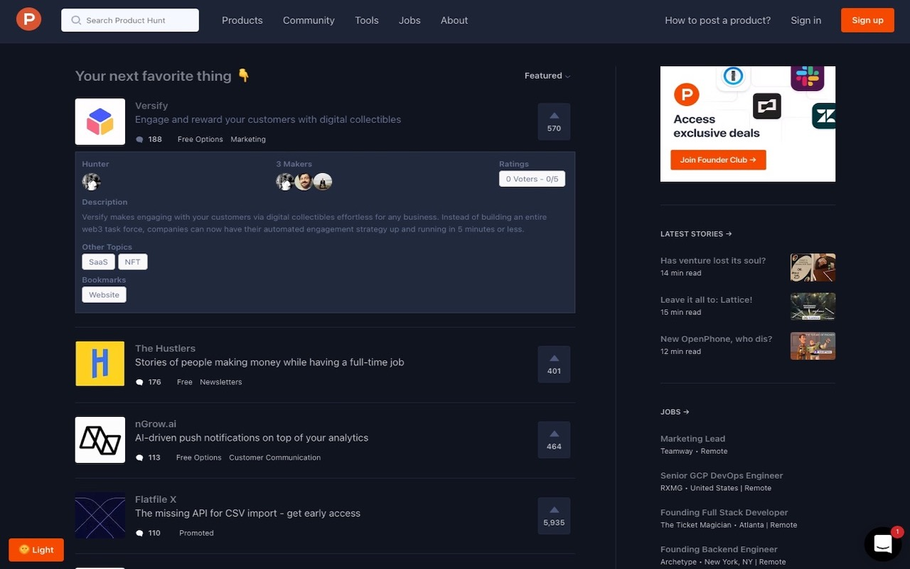

# My Product Hunt Browser Extension
Adds Dark Mode Theme and no click product info block of Product Hunt website.

## Feature
- (NEW) Product Hunt Dark Mode is ready to use
- Shows more data of product detail without go to detail pages
- Add "Dark Mode" toggle button (left bottom corner)

## Compatibility
- Chrome (Manifestv3)
- Firefox (Manifestv2)
- Microsoft Edge (Manifestv3)

## Installation

### Chrome Store/Firefox Add-Ons

Go to [My Product Hunt](https://chrome.google.com/webstore/detail/jbchipnpikoidnjdgmjdipiandcjhilp) Chrome Store Page

Go to [My Product Hunt](https://addons.mozilla.org/en-US/firefox/addon/my-product-hunt/) Firefox Add-Ons Page

### Local Development

- Run `./build.<env>.sh <NEW_VERSION>` (./build.dev.sh 1.0.0) command after go to "build" folder.

1. Open Chrome and go to: chrome://extensions/
2. Enable: "Developer mode"
3. Click: "Load unpacked extension"
4. Select: "extension" directory
5. Ready to use
6. Go to producthunt website

### Usage
- In the left corner of the browser, the "Dark or Light" button notifies you that the plugin is active for "Dark Mode"

## Licence
See LICENSE for more details.